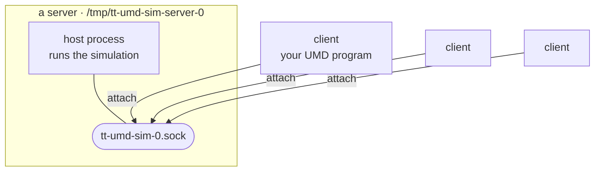
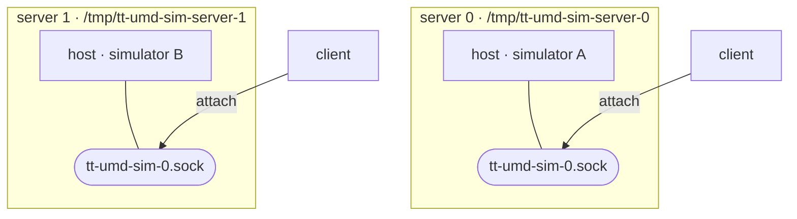
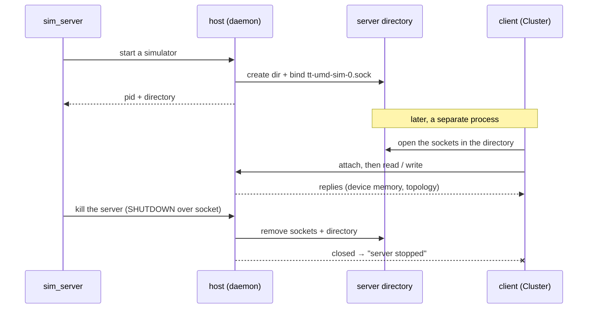

# Simulation Server

UMD can run against a *simulated* device instead of real hardware. The **simulation server** lets one
process **host** a simulated device and have other UMD processes **attach** to it and drive it exactly
as they would a real cluster. That way a single running simulation can be shared by several processes
at once, instead of each process spinning up its own.

## Host and client

You don't pick a role explicitly — UMD decides it from what you point it at:

- Point it at a **simulator** → your process is the **host**: it runs the simulation and serves it.
- Point it at the **directory where a running server keeps its sockets** → your process is a
  **client**: it attaches to the host and uses the simulation without running one itself.

A host and its clients run on the same machine and communicate over per-chip sockets kept in that
server's directory (see [Where things live](#where-things-live)).



### More than one server

Each host gets its **own directory** for its sockets, so several servers can run on one machine at
the same time without stepping on each other — even if they serve the same chip ids. You point a
client at the directory of whichever server you want to attach to. `sim_server list` shows them all,
each with an **index** you use to refer to it.



## The flow

1. **Start a server.** Launch a host in the background with the `sim_server` tool:

   ```
   sim_server start <simulator>
   ```

   It brings the simulation up, starts serving it in a freshly allocated server directory, and
   returns — printing the host pid and that directory, e.g.
   `serving <simulator> in /tmp/tt-umd-sim-server-0`. Other processes can now attach. Start another
   server the same way and it gets its own directory (`.../tt-umd-sim-server-1`).

2. **See what's running.**

   ```
   sim_server list
   ```

   Lists the open servers. Each row is one chip of one server: the server index, the chip id,
   whether it is reachable, its arch/backend, and the socket it is served on.

   ```
   SERVER   CHIP   STATE   ARCH             SOCKET
   0        0      live    blackhole/ttsim  /tmp/tt-umd-sim-server-0/tt-umd-sim-0.sock
   1        0      live    blackhole/ttsim  /tmp/tt-umd-sim-server-1/tt-umd-sim-0.sock
   ```

3. **Use it from your program.** Open a UMD cluster in simulation mode pointed at a server's socket
   directory (the `SOCKET`'s parent above, e.g. `/tmp/tt-umd-sim-server-0`). UMD sees the live
   sockets there, attaches as a client, and from then on you use the cluster exactly as you would
   against real hardware — reading and writing device memory and so on. Your program's code is the
   same whether it runs on hardware or against a shared simulation.

4. **Stop the server.**

   ```
   sim_server kill <server>
   ```

   `<server>` is the index shown by `sim_server list`. This shuts that host down and disconnects its
   clients.

At a glance, over the life of one server:



## Connecting from code

Attaching to a running server is the same code path as opening real hardware — you point UMD at that
server's socket directory instead of picking a role. There are two levels you can enter at.

### At the Cluster level

The usual entry point. Construct a `Cluster` in simulation mode pointed at a server's socket
directory; UMD sees the live sockets, attaches to each as a client, and hands you a cluster you drive
exactly as you would silicon.

```cpp
#include "umd/device/cluster.hpp"

using namespace tt::umd;

ClusterOptions options;
options.chip_type = ChipType::SIMULATION;
options.simulator_directory = "/tmp/tt-umd-sim-server-0";  // a server's directory (from `list`)
Cluster cluster(options);

// From here the cluster behaves like any other -- the same code runs against
// hardware or against a shared simulation.
for (ChipId chip : cluster.get_target_device_ids()) {
    uint32_t value = 0;
    cluster.read_from_device(&value, chip, core, addr, sizeof(value));
}
```

### At the discovery level

One level down. `SimulationConnector::discover()` is the step `Cluster` runs for you: it attaches to
each per-chip socket in the directory and returns the client devices, keyed by the same chip ids the
host serves. Enter here when you want the devices directly rather than a full cluster. (This is
simulation's discovery entry point; the silicon `TopologyDiscovery` path is not involved.)

```cpp
#include "umd/device/simulation/simulation_connector.hpp"
#include "umd/device/tt_device/tt_device.hpp"

using namespace tt::umd;

SimulationConnectorOptions options;
options.simulator_directory = "/tmp/tt-umd-sim-server-0";  // same server directory
std::map<ChipId, std::unique_ptr<TTDevice>> devices = SimulationConnector::discover(options);

// Each device is a client already attached to the running host.
for (auto& [chip_id, device] : devices) {
    // use `device` directly, or hand it to higher-level UMD code
}
```

In both cases the target is the server directory, and pointing at it is what makes your process a
client — there is no separate "connect" call.

## Where things live

- **Server directories.** One per running server, under the system temporary directory (`/tmp` on
  Linux), named `tt-umd-sim-server-<index>`. The index counts up from 0; each `start` claims the
  lowest free one.
- **Sockets.** One per chip, inside that server's directory, named `tt-umd-sim-<chip_id>.sock`. A
  server directory *is* what a client points at, and what `sim_server list` scans — there is no
  central registry, just the directories present on disk. When a server shuts down it removes its
  sockets and its (now-empty) directory.
- **Server logs.** `sim_server start` detaches the host from your terminal, so its output goes to a
  per-server log in the temporary directory: `tt-umd-sim-server-<pid>.log`. Check it if a server did
  not come up.

## What happens under the hood

Each simulated chip is exposed as a socket in its server's directory. The host answers device
operations and describes the cluster topology over that socket; a client forwards its operations to
the host and applies the replies, so on the client side the device behaves like any other. Stopping a
server tears it down cleanly and closes its client connections, so a client's in-flight or next
operation fails with a clear "server stopped" error instead of hanging — letting the client notice
and exit gracefully.

## Good to know

- **Multiple servers coexist.** Each host has its own directory, so you can run several simulators on
  one machine at once — including two of the same chip id. Point each client at the server directory
  it wants (from `sim_server list`).
- **Clients fail cleanly.** If the server goes away, a client's next operation raises a clear error
  rather than hanging.
- **Shared on the machine.** Any user on the same machine can attach to a running server — the sockets
  are shared, not private to one user.
