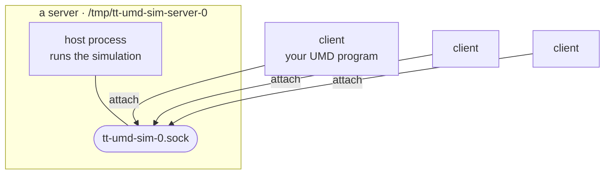
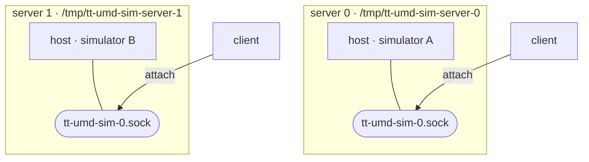
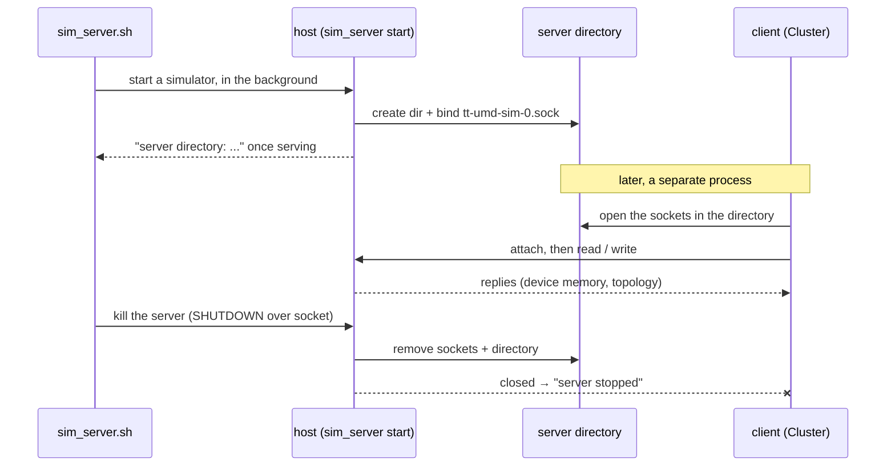

# Simulation Server

UMD can run against a *simulated* device instead of real hardware, using
[ttsim](https://github.com/tenstorrent/ttsim) (a `libttsim.so` for a given architecture) or an RTL
simulator build. The **simulation server** lets one process **host** a simulated device and have other
UMD processes **attach** to it and drive it exactly as they would a real cluster.

Without it each process gets its own independent simulation, so two processes never see each other's
writes.

## Host and client

You don't pick a role explicitly — UMD decides it from what you point it at:

- Point it at a **simulator** → your process is the **host**: it runs the simulation and serves it.
- Point it at the **directory where a running server keeps its sockets** → your process is a
  **client**: it attaches to the host and uses the simulation without running one itself.

A host and its clients run on the same machine and communicate over per-chip sockets kept in that
server's directory (see [Where things live](#where-things-live)).

### Any UMD process can be the host

Hosting is a `Cluster` option, not something special to the tool:

```cpp
options.serve_simulation_devices_over_sockets = true;   // default: false
```

It is **off by default**, so an ordinary simulator run — a UMD or tt-metal test pointed at a
`libttsim.so` — hosts a private in-process simulation and publishes nothing. `sim_server` is just a
host that sets the flag and stays alive.


```mermaid
flowchart TB
  subgraph server["a server · /tmp/tt-umd-sim-server-0"]
    host["host process<br/>runs the simulation"]
    sock(["tt-umd-sim-0.sock"])
    host --- sock
  end
  c1["client<br/>your UMD program"] -->|attach| sock
  c2["client"] -->|attach| sock
  c3["client"] -->|attach| sock
```

### More than one server

Each host gets its **own directory** for its sockets, so several servers can run on one machine at
the same time without stepping on each other — even if they serve the same chip ids. You point a
client at the directory of whichever server you want to attach to. `sim_server list` shows them all,
each with an **index** you use to refer to it.


```mermaid
flowchart TB
  subgraph s0["server 0 · /tmp/tt-umd-sim-server-0"]
    h0["host · simulator A"]
    k0(["tt-umd-sim-0.sock"])
    h0 --- k0
  end
  subgraph s1["server 1 · /tmp/tt-umd-sim-server-1"]
    h1["host · simulator B"]
    k1(["tt-umd-sim-0.sock"])
    h1 --- k1
  end
  ca["client"] -->|attach| k0
  cb["client"] -->|attach| k1
```

## The flow

1. **Start a server.** Launch a host in the background with the `sim_server.sh` wrapper:

   ```
   sim_server.sh start <simulator>
   ```

   It brings the simulation up in a freshly allocated server directory and returns once the sockets
   are actually serving — printing the host pid, that directory, and where its log went, e.g.
   `sim_server up: pid 12345, serving /tmp/tt-umd-sim-server-0, log /tmp/sim_server-tt-umd-sim-server-0.log`.
   Other processes can now attach. Start another server the same way and it gets its own directory
   (`.../tt-umd-sim-server-1`).

   The `sim_server` binary itself runs in the foreground: `sim_server start <simulator>` serves until
   you stop it with `Ctrl-C`, `SIGTERM`, or `sim_server kill`. That is handy when you want the host
   in a terminal you are watching. The wrapper is what adds the backgrounding, the per-server log,
   and the check that startup actually succeeded; every other subcommand it forwards to the binary
   untouched, so `sim_server.sh list` and `sim_server list` are the same thing.

2. **See what's running.**

   ```
   sim_server list
   ```

   Lists the open servers. Each row is one chip of one server: the server index, the chip id,
   whether it is reachable, its arch/backend, and the socket it is served on.

   ```
   SERVER   CHIP   STATE   ARCH             SOCKET
   0        0      live    blackhole/ttsim  /tmp/tt-umd-sim-server-0/tt-umd-sim-0.sock
   1        0      live    blackhole/ttsim  /tmp/tt-umd-sim-server-1/tt-umd-sim-0.sock
   ```

3. **Use it from your program.** Point UMD at the server *directory* (the `SOCKET`'s parent above,
   e.g. `/tmp/tt-umd-sim-server-0`) instead of at a simulator. UMD sees the live sockets, attaches as
   a client, and from then on you drive the cluster exactly as you would real hardware. There is no
   separate "connect" call — the path you pass is what makes you a client.

   Wherever you would name a `libttsim.so` — `TT_UMD_SIMULATOR`, `TT_METAL_SIMULATOR`, or
   `ClusterOptions::simulator_directory` — name the server directory instead. So an existing test runs
   against a server with no code change:

   ```
   TT_UMD_SIMULATOR=/tmp/tt-umd-sim-server-0 \
     ./build/test/umd/api/api_tests --gtest_filter="TestDeviceIOFixture.RegReadWrite"
   ```

   There is no Python entry point today.

4. **Stop the server.**

   ```
   sim_server kill <server>
   ```

   `<server>` is the index shown by `sim_server list`. This shuts that host down and disconnects its
   clients.

   A host that shuts down this way removes its own directory. One that was killed or crashed cannot,
   so it leaves a directory behind — `list` shows it as `unreachable`. Clear those out with:

   ```
   sim_server.sh prune
   ```

   It removes the directories and logs of servers that no longer answer, and leaves live ones alone.

At a glance, over the life of one server:


```mermaid
sequenceDiagram
  participant Tool as sim_server.sh
  participant Host as host (sim_server start)
  participant Dir as server directory
  participant Client as client (Cluster)
  Tool->>Host: start a simulator, in the background
  Host->>Dir: create dir + bind tt-umd-sim-0.sock
  Host-->>Tool: "server directory: ..." once serving
  Note over Client,Dir: later, a separate process
  Client->>Dir: open the sockets in the directory
  Client->>Host: attach, then read / write
  Host-->>Client: replies (device memory, topology)
  Tool->>Host: kill the server (SHUTDOWN over socket)
  Host->>Dir: remove sockets + directory
  Host--xClient: closed → "server stopped"
```

## Connecting from code

Attaching to a running server is the same code path as opening real hardware — you point UMD at that
server's socket directory instead of picking a role. There are two levels you can enter at.

### At the Cluster level

The usual entry point. Construct a `Cluster` in simulation mode pointed at a server's socket
directory; UMD sees the live sockets, attaches to each as a client, and hands you a cluster you drive
exactly as you would silicon.

```cpp
#include "umd/device/cluster.hpp"
#include "umd/device/types/core_coordinates.hpp"

using namespace tt::umd;

ClusterOptions options;
options.chip_type = ChipType::SIMULATION;
options.simulator_directory = "/tmp/tt-umd-sim-server-0";  // a server's directory (from `list`)
Cluster cluster(options);

// From here the cluster behaves like any other -- the same code runs against
// hardware or against a shared simulation.
for (ChipId chip : cluster.get_target_device_ids()) {
    // Pick something to access -- here the first Tensix core, at address 0x1000.
    const CoreCoord core = cluster.get_soc_descriptor(chip).get_cores(CoreType::TENSIX).at(0);
    const uint64_t addr = 0x1000;

    uint32_t value = 0;
    cluster.read_from_device(&value, chip, core, addr, sizeof(value));
}
```

### At the discovery level

One level down. `SimulationConnector::discover()` is the step `Cluster` runs for you: it attaches to
each per-chip socket in the directory and returns the client devices, keyed by the same chip ids the
host serves. Enter here when you want the devices directly rather than a full cluster. (This is
simulation's discovery entry point; the silicon `TopologyDiscovery` path is not involved.)

```cpp
#include "umd/device/simulation/simulation_connector.hpp"
#include "umd/device/tt_device/tt_device.hpp"

using namespace tt::umd;

SimulationConnectorOptions options;
options.simulator_directory = "/tmp/tt-umd-sim-server-0";  // same server directory
std::map<ChipId, std::unique_ptr<TTDevice>> devices = SimulationConnector::discover(options);

// Each device is a client already attached to the running host.
for (auto& [chip_id, device] : devices) {
    // use `device` directly, or hand it to higher-level UMD code
}
```

In both cases the target is the server directory, and pointing at it is what makes your process a
client — there is no separate "connect" call.

## Where things live

- **Server directories.** One per running server, under the system temporary directory (`/tmp` on
  Linux), named `tt-umd-sim-server-<index>`. The index counts up from 0; each `start` claims the
  lowest free one.
- **Sockets.** One per chip, inside that server's directory, named `tt-umd-sim-<chip_id>.sock`. A
  server directory *is* what a client points at, and what `sim_server list` scans — there is no
  central registry, just the directories present on disk. When a server shuts down it removes its
  sockets and its (now-empty) directory.
- **Server logs.** Started through `sim_server.sh`, a host is detached from your terminal and its
  output goes to a per-server log in the temporary directory, named after the server directory:
  `sim_server-tt-umd-sim-server-<index>.log`. Check it if a server did not come up. Started directly
  with `sim_server start`, the host runs in the foreground and logs to your terminal.

## What happens under the hood

Each simulated chip is exposed as a socket in its server's directory. The host answers device
operations and describes the cluster topology over that socket; a client forwards its operations to
the host and applies the replies, so on the client side the device behaves like any other.

Stopping a server does **not** stop its clients — it closes their connections, so a client's next
operation fails with a clear "server stopped" error instead of hanging, and the client decides what to
do. Each process is started and stopped on its own.

## Good to know

- **Multiple servers coexist.** Each host has its own directory, so you can run several simulators on
  one machine at once — including two of the same chip id. Point each client at the server directory
  it wants (from `sim_server list`).
- **Clients fail cleanly.** If the server goes away, a client's next operation raises a clear error
  rather than hanging.
- **Shared on the machine.** The sockets are world-writable (`srw-rw-rw-`), so any user can attach —
  which is also why `kill` goes over the socket rather than by signal.
- **Sysmem is not carried over the socket.** Device memory and registers work from a client; sysmem
  access crashes (`TestDeviceIOFixture.SysmemReadWrite` segfaults in client mode).
