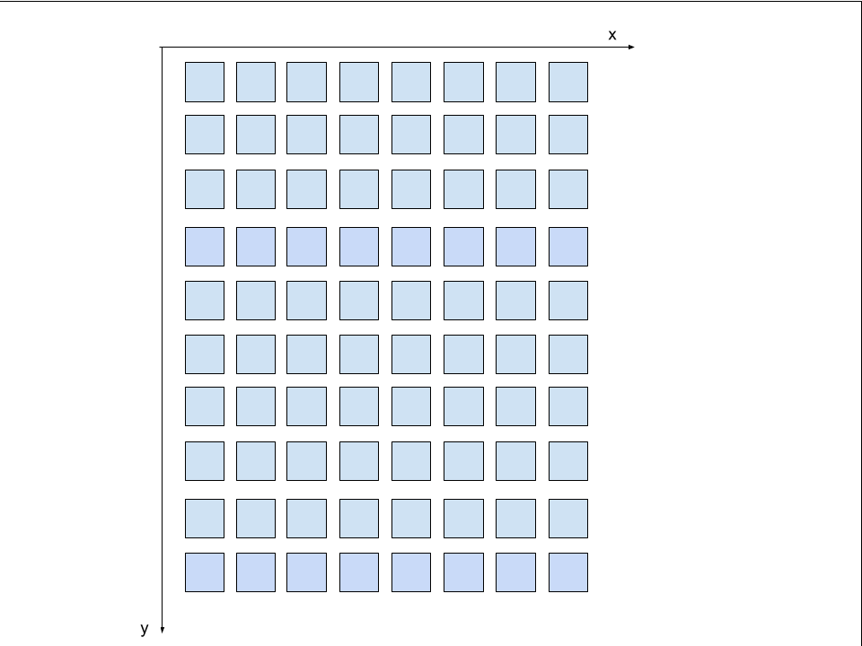
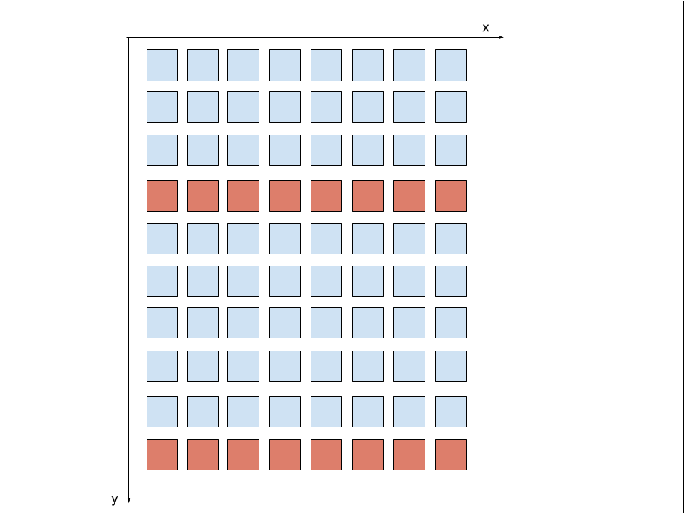
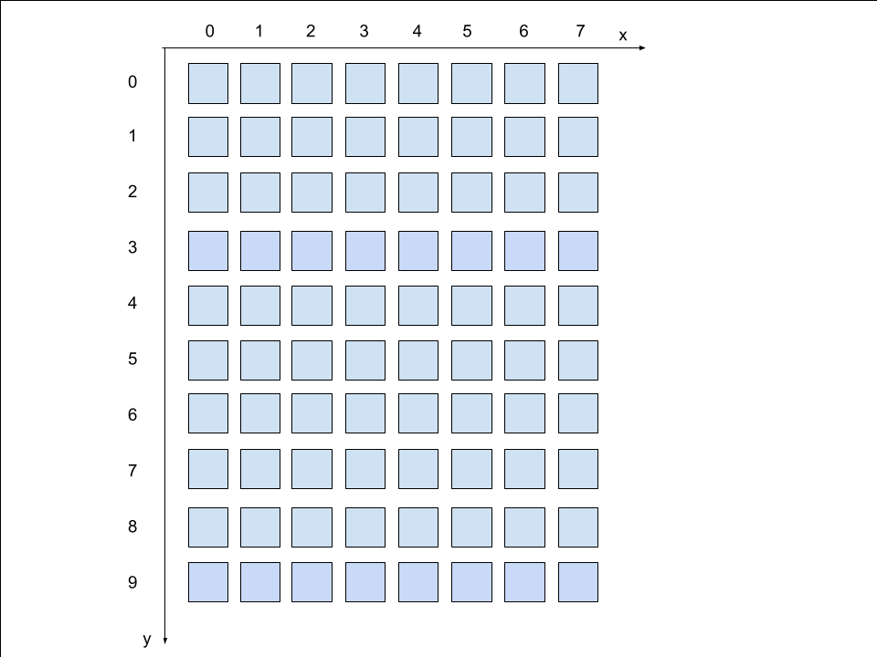
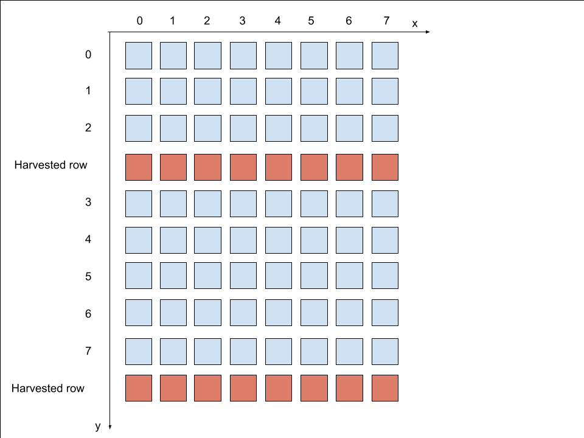
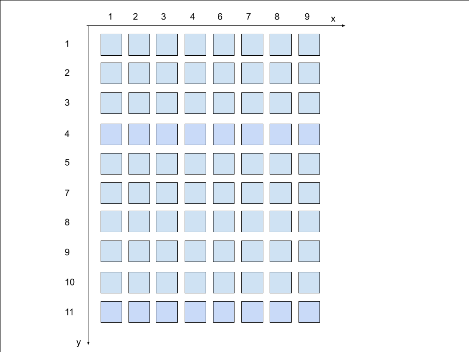
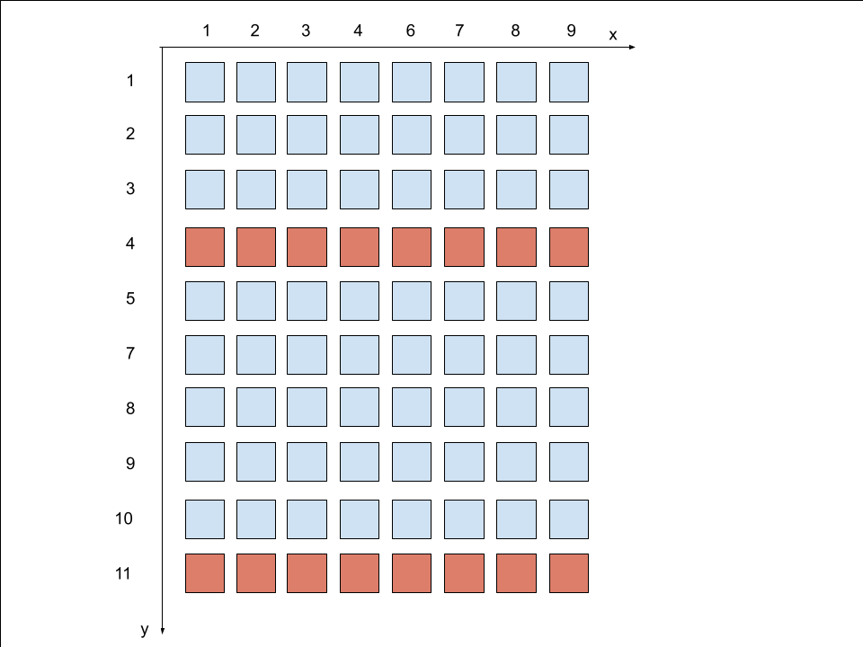
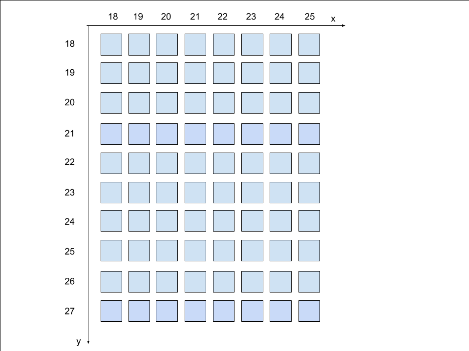
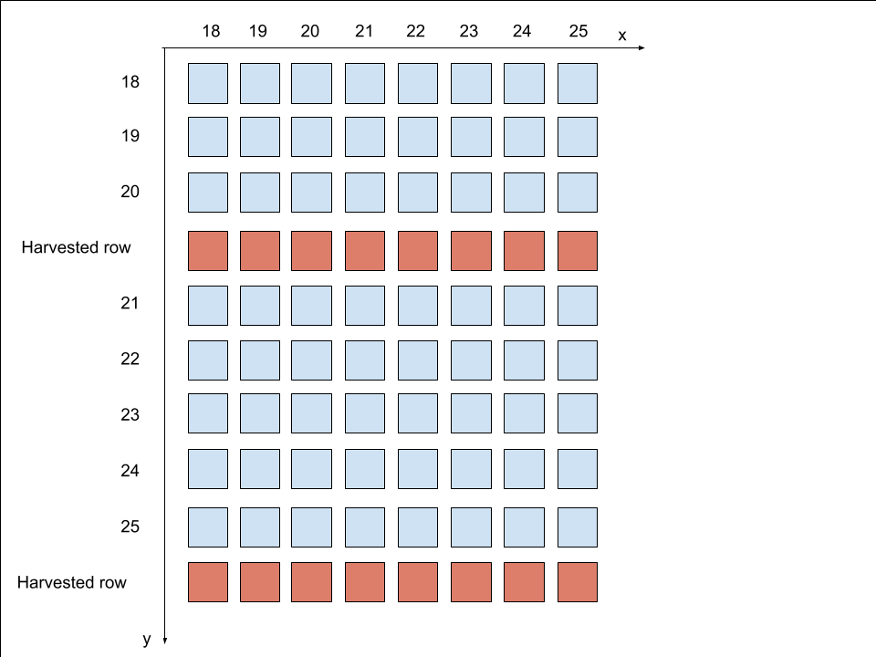

Wiki on coordinates understood by UMD

- [Summary](#summary)
   * [Important notes for further reading](#important-notes-for-further-reading)
- [Harvesting basics](#harvesting-basics)
    * [Grayskull harvesting](#grayskull-harvesting)
    * [Wormhole harvesting](#wormhole-harvesting)
    * [Blackhole harvesting](#blackhole-harvesting)
- [Coordinate systems](#coordinate-systems)
   * [Logical coordinates](#logical-coordinates)
      + [Harvesting effect on logical coordinates](#harvesting-effect-on-logical-coordinates)
   * [Physical Coordinates](#physical-coordinates)
      + [Harvesting effect on physical coordinates](#harvesting-effect-on-physical-coordinates)
   * [Virtual coordinates](#virtual-coordinates)
   * [Translated Coordinates](#translated-coordinates)
      + [Grayskull translated coordinates](#grayskull-translated-coordinates)
      + [Wormhole translated coordinates](#wormhole-translated-coordinates)
      + [Blachkole translated coordinates](#blachkole-translated-coordinates)
   * [Full example](#full-example)
   * [Coordinate systems relations](#coordinate-systems-relations)
      + [Grayskull](#grayskull)
      + [Wormhole**](#wormhole)
      + [Blackhole](#blackhole)

# Summary

This documentation is intended to be used as a guide to understanding harvesting of Tenstorrent chips, as well as understanding different coordinate systems for cores on the chip.

This document describes coordinate systems of the chip cores and harvesting in the following sequence:

1. Harvesting basics
2. Different coordinate systems used
3. How does harvesting affect coordinate systems
4. Programming guide using different coordinate systems

Prior to reading this document, it is recommended the reader is familiar with following concepts
- General architecture of the current generation of Tenstorrent chips (Grayskull, Wormhole, Blackhole)
- Difference between different core types (Tensix, DRAM, PCIe, ARC, Ethernet)

## Important notes for further reading

- Annotation X x Y (for example, 8x10) represents that we have X cores on the x axis, and Y cores on the Y axis. In terms of row/column view, that would mean that we have Y rows and X columns. Example for 8x10 is the image below

# Harvesting basics

In basic terms, harvesting represents turning off certain cores on the chip. This is done for various reasons, for example faulty cores on the chip can be harvested. Only certain types of cores are harvested on Tenstorrent chips, based on the chip architecture.

Harvesting refers to cores being disabled due to binning. Workloads cannot be run on these cores and they can only be used for data routing. In this doc, it is discussed how different coordinate systems can be used to program Tenstorrent chip with custom harvesting spec.

### Grayskull harvesting

On Grayskull, harvesting of tensix rows is supported. That means that on the tensix grid (12x10) there will always be 12 columns of chips, but number of rows can decrease. In practice, Grayskull chips have one or two rows harvested.

Harvesting of non-tensix cores (DRAM, PCIe, ARC, Ethernet) is  not supported.

### Wormhole harvesting

On wormhole, harvesting of tensix rows is supported. That means that on the tensix grid (8x10) there will always be 8 columns of chips, but number of rows can decrease. In practice, Wormhole chips have one or two rows harvested. Example for two harvested rows is in the image below.

Note that there is no limitation on which specific rows can be harvested.

Harvesting of non-tensix cores (DRAM, PCIe, ARC, Ethernet) is not supported on Wormhole.

### Blackhole harvesting

On Blackhole, harvesting of tensix columns is supported. That means that on the tensix grid (14x10), there will always be 10 rows of tensix cores, but number of columns may decrease. In practice, Blackhole chips have (TODO: how many columns) columns harvested. Example for two harvested columns is in the image below.

(TODO: attach image of harvested columns)

Note that there is no limitation on which specific columns can be harvested.

(TODO: dram harvesting)

Harvesting of other cores (PCIe, ARC, Ethernet) is not supported on Blackhole.

# Coordinate systems

In the following section, coordinate systems that can be used to access cores are going to be described. For each coordinate system it will be described how does harvesting affect access to different cores when using certain coordinate system, as well as the API support through UMD for this coordinate system.

To keep everything consistent, example of 8x10 grid, which represents Wormhole chip, is going to be used in each image in this section.

In order to illustrate harvesting effect on coordinate systems, example with two harvested rows of Tensix cores (image below) is going to be used

## Logical coordinates

This coordinate system is mostly used to reference Tensix cores, since this cores are most frequently accessed. This coordinate system hides the details of physical coordinates and allows upper layers of the stack to access Tensix endpoints through a set of traditional Cartesian Coordinates. This coordinate systems has very simple indexing, it starts from `0-0` and ends at `(X-1)-(Y-1)` where X and Y is number of cores on x-axis and y-axis, respectively. Example on logical coordinate indexing is one the image below

Logical coordinates are used in a same way for Grayskull, Wormhole and Blackhole, only difference being in grid size of tensix cores.

### Harvesting effect on logical coordinates

Using harvesting example, the effect on logical coordinates for two harvested configuration is on the image below

Note that range on X axis stays the same (no harvested columns), but the range on Y axis is smaller by two (number of harvested rows).

## Physical Coordinates

These are the NOC coordinates that the hardware understands, there are two distinct variations for NOC0 and NOC1. In hardware, each node is given an ID (which is different for each NOC), represented as x-y pair, which can be used to identify this node. In the SOC descriptor, physical coordinates are specified for NOC0.

### Harvesting effect on physical coordinates

Using harvesting example, the effect on physical coordinates for two harvested configuration is on the image below

Note that physical coordinates stay the same, coordinates are not changed, some coordinates simply become unavailable. The user of UMD needs to be careful not to hit harvested coordinates, or the chip is going to hang.

## Virtual coordinates

Virtual Coordinates are a subset of the full chip Physical Coordinates shown above, allowing users to treat either coordinate system in a similar manner.
(TODO: describe virtual coordinates, is there even a use case for these?)

## Translated Coordinates

**Motivation: Allow binaries to be compatible across different Wormhole devices, as long as their grid sizes are identical.**

Wormhole and later architectures implement a programmable coordinate translation table in hardware for each row and column.  Programming is done ahead of time by ARC firmware. The coordinates are dynamically mapped to each physical node through hardware LUTs, which depend on the harvesting configuration.

This coordinate system aims to abstract away the effects of harvesting (see below) by relying on a convex grid of worker cores. This allows each layer to be oblivious to the effects of harvesting.

Translated coordinates can be used to program TLBs and other things that are used for targeting NOC endpoints.

### Grayskull translated coordinates

Translated coordinates are not supported on Grayskull. Physical coordiantes must be used on Grayskull for targeting NOC endpoints.

### Wormhole translated coordinates

Translated coordinates on Wormhole are supported for Ethernet and Tensix cores. Translated coordinates on Wormhole start at 16-16 (due to hardware design features) and go through a hardware based LUT to access physical tensix endpoints. Example mapping for Tensix and Ethernet cores to translated coordinates are below

Harvesting some number of rows would have the same effect as for logical coordinates, range of coordinates still stays contigouous, there are just less cores on the harvested axis. 

### Blachkole translated coordinates

(TODO:pjanevski write a doc about translated coordinates on Blackhole)

## Full example

(TODO:pjanevski write full mapping for all cores on a grid)

## Coordinate systems relations

### Grayskull

* Virtual Coordinates == Physical Coordinates == Translated Coordinates for all cases (no translation tables on this Device).

### Wormhole

When no harvesting has taken place (chip has full grid size):
* Virtual Coordinates == Physical Coordinates for all cores
* Virtual Coordinates != Translated Coordinates for Tensix and Ethernet
* Virtual Coordinates == Translated Coordinates for ARC/PCIE/DRAM

When harvesting is perfomed on a chip:
* Virtual Coordinates == Physical Coordinates == Translated Coordinates for ARC/PCIE/DRAM
* Virtual Coordinates != Translated Coordinates for Tensix and Ethernet
* Virtual Coordinates != Physical Coordinates for Tensix and Ethernet

### Blackhole

(TODO:pjanevski blackhole coordinate realations)